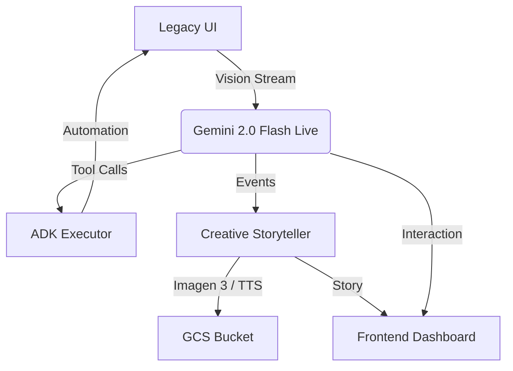

# 🌉 LegacyBridge ULTRA 
### *Bridging the gap between Legacy Systems and the Modern Cloud with Gemini 2.0 Flash Live*

[](https://ai.google.dev/)
[](https://fastapi.tiangolo.com/)
[](https://react.dev/)

LegacyBridge ULTRA is a multimodal AI agent built for the **Gemini Live API Hackathon**. It leverages the low-latency vision and voice capabilities of Gemini 2.0 Flash Live to observe legacy software UI, understand workflows, and automate the migration process while generating real-time training materials.

---

## ⚡ Quick Start (One Command)
To run the entire application (Backend + Frontend) locally, copy and paste this command:

```bash
cd ~/.gemini/antigravity/scratch/LegacyBridgeULTRA && chmod +x start.sh && ./start.sh
```

**Automated Setup Includes:**
- 🔑 **API Key Configuration**: Securely prompts for Google AI Studio & GCP keys.
- 🧹 **Process Management**: Automatically clears port conflicts (8080/5173).
- 📦 **Dependency Handling**: Skips redundant installs for lightning-fast startup.
- 🌍 **Auto-Browser**: Opens the premium dashboard immediately when ready.

---

## ✨ Key Features
- **🎙️ Multimodal Live Grounding**: Real-time vision/voice interaction with legacy UIs via Gemini 2.0 Flash Live.
- **☸️ ADK Executor**: Automated UI navigation and data entry using Python-based GUI automation.
- **✍️ Creative Storyteller**: Dynamically generates post-migration training guides and videos using Imagen 3 and Vertex AI.
- **🌿 Green Mode**: Optimized logic to minimize token usage and cloud compute footprint.
- **🛡️ Audit Logs**: Full session recording and field mapping stored in Firestore for compliance.

---

## 🏗️ Architecture


## 🛠️ Tech Stack
- **Core**: Gemini-2.0-flash-live-001, google-genai SDK.
- **Backend**: FastAPI (Python 3.10), PyAutoGUI, Firestore, Cloud Storage.
- **Frontend**: React 19, Vite 8, TailwindCSS 4 (Black/Glassmorphism theme).
- **Automation**: Xvfb (Virtual Display) for headless cloud execution.

---

## 🛡️ Security
API keys are never committed. The `start.sh` script generates a local `.env` file excluded via `.gitignore`. 

*Built with ❤️ by the Google Cloud Agentic Team for the Gemini Live API Hackathon.*
