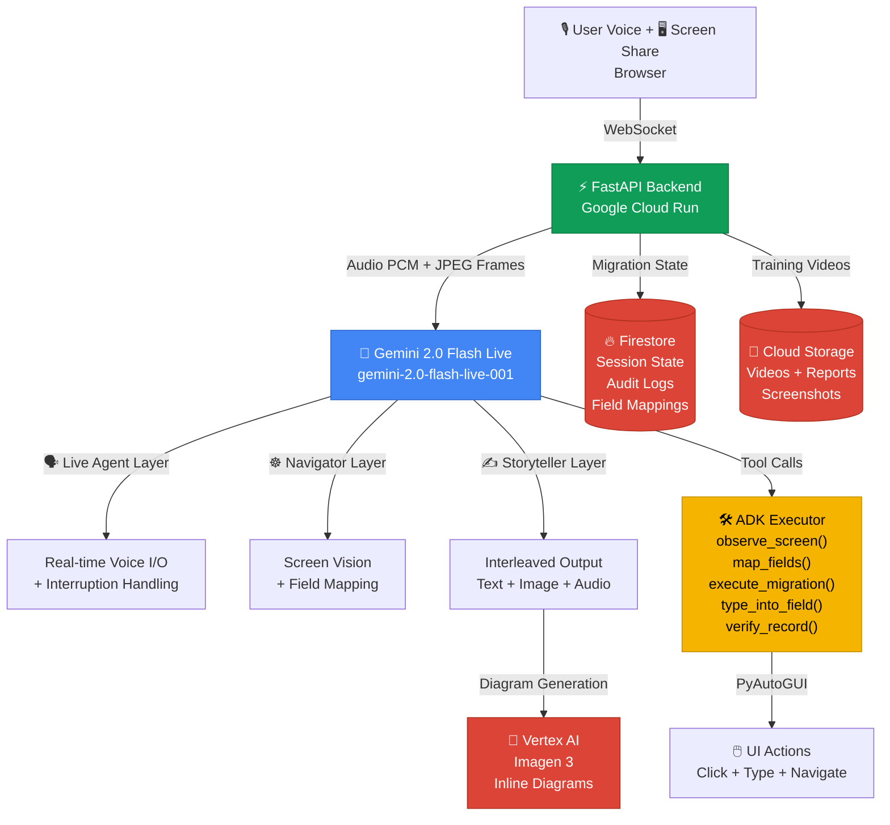

<div align="center">

# 🌉 LegacyBridge ULTRA
### Multimodal Migration Agent — Gemini Live API Hackathon 2026

[](https://ai.google.dev)
[](https://cloud.google.com)
[](https://google.github.io/adk-docs)
[](LICENSE)

**One AI agent that sees your legacy enterprise software, migrates it to modern SaaS via real-time voice, and auto-generates staff training videos — all at once.**

[🚀 Quick Start](#-quick-start) • [✨ Features](#-features) • [🏗️ Architecture](#-architecture) • [📹 Demo](#-demo) • [🛠️ Tech Stack](#-tech-stack)

</div>

---

## 🏆 Hackathon Categories

This project was designed to qualify for **all three Gemini Live Agent Challenge categories simultaneously:**

| Category | How LegacyBridge Covers It |
|---|---|
| 🗣️ **Live Agents** | Gemini 2.0 Flash Live — real-time bidirectional voice + screen vision + natural interruption handling |
| ☸️ **UI Navigator** | Pure visual screen understanding (zero API/DOM/source code) + ADK autonomous execution |
| ✍️ **Creative Storyteller** | Interleaved training video: narration + Imagen 3 diagrams + multilingual voiceover in one stream |

---

## 💡 The Problem

Every company in the world is secretly running software from the 1990s. Banks on SAP. Hospitals on MUMPS. Government offices on custom Access databases. A single enterprise migration costs **$2M–$20M** and takes **12–36 months**. 70% fail or go over budget.

**LegacyBridge ULTRA solves this with one AI agent.**

---

## ✨ Features

- 🎙️ **Multimodal Live Grounding** — Real-time voice and vision with Gemini 2.0 Flash Live. The agent sees your screen AND hears you simultaneously, with natural interruption support mid-sentence.
- ☸️ **ADK UI Navigator** — Autonomous UI navigation using `observe_screen()`, `map_fields()`, `execute_migration()`, `type_into_field()`, `verify_record()` — works on ANY legacy software with zero API access.
- ✍️ **Creative Storyteller** — Post-migration training video generated via Gemini interleaved output: narration text + Imagen 3 diagrams + multilingual Google TTS voiceover in one unified stream.
- 🌿 **Green Mode** — Optimized logic to minimize token usage and cloud compute footprint.
- 🛡️ **Audit Logs** — Full session recording and field mapping stored in Firestore for compliance.
- 🔍 **Visual Verification** — After every record migration, agent screenshots both systems and compares them using Gemini vision to guarantee zero data loss.

---

## 🚀 Quick Start

### One Command Setup
```bash
cd ~/.gemini/antigravity/scratch/LegacyBridgeULTRA && chmod +x start.sh && ./start.sh
```

The `start.sh` script automatically:
- 🔑 Prompts for your Google AI Studio API Key and GCP Project ID
- 🧹 Clears port conflicts on 8080 and 5173
- 📦 Installs all dependencies (skips if already installed)
- 🌍 Opens the dashboard automatically in your browser

### Manual Setup

**Prerequisites:**
- Python 3.10+
- Node.js 18+
- Google AI Studio API Key → [aistudio.google.com](https://aistudio.google.com)
- GCP Project ID → [console.cloud.google.com](https://console.cloud.google.com)

**Step 1 — Clone**
```bash
git clone https://github.com/ar48code-dev/legacybridge.git
cd legacybridge
```

**Step 2 — Backend**
```bash
cd backend
pip install -r requirements.txt
cp .env.example .env
# Edit .env and add your GOOGLE_API_KEY and GCP_PROJECT_ID
uvicorn main:app --reload --port 8080
```

**Step 3 — Frontend**
```bash
cd frontend
npm install
npm run dev
```

**Step 4 — Open**
```
http://localhost:5173
```
Click the ⚙️ gear icon → Enter your API Key + GCP Project ID → **START MISSION**

---

## 🏗️ Architecture

### System Flow



### Architecture Diagram (Static)

```
╔══════════════════════════════════════════════════════════════╗
║                   LEGACYBRIDGE ULTRA                         ║
║           All 3 Hackathon Categories · One Agent             ║
╚══════════════════════════════════════════════════════════════╝

┌──────────────────────────────────────────────────────────────┐
│                      USER BROWSER                            │
│  ┌─────────────┐  ┌──────────────┐  ┌──────────────────┐    │
│  │🎙️ Microphone │  │🖥️ Screen Share│  │ ⚛️ React Dashboard│    │
│  │ PCM 16kHz   │  │  JPEG 1fps   │  │  Vite + Tailwind │    │
│  └──────┬──────┘  └──────┬───────┘  └────────┬─────────┘    │
└─────────┼────────────────┼───────────────────┼──────────────┘
          └────────────────┴───────────────────┘
                           │ WebSocket
                           ▼
┌──────────────────────────────────────────────────────────────┐
│            FASTAPI BACKEND · Google Cloud Run                │
│  ┌──────────────┐ ┌──────────────┐ ┌──────────────────────┐  │
│  │ Audio Router │ │Frame Processor│ │    ADK Executor      │  │
│  │  (WS relay)  │ │  (1fps JPEG) │ │  observe_screen()    │  │
│  └──────┬───────┘ └──────┬───────┘ │  map_fields()        │  │
│         └────────────────┘         │  execute_migration() │  │
│                  │                 │  type_into_field()   │  │
│                  │                 │  verify_record()     │  │
└──────────────────┼─────────────────┴──────────┬───────────┘
                   │                             │
                   ▼                             ▼
┌──────────────────────────────┐  ┌─────────────────────────────┐
│  GEMINI 2.0 FLASH LIVE API   │  │       ADK TOOL CALLS        │
│  ┌──────────────────────┐    │  │  ┌───────────────────────┐  │
│  │ 🗣️ Live Agent Layer   │    │  │  │  PyAutoGUI Actions    │  │
│  │ Voice + Interrupts   │    │  │  │  click() type()       │  │
│  ├──────────────────────┤    │  │  │  navigate() verify()  │  │
│  │ ☸️ Navigator Layer    │    │  │  └───────────────────────┘  │
│  │ Screen Vision + Map  │    │  └─────────────────────────────┘
│  ├──────────────────────┤    │
│  │ ✍️ Storyteller Layer  │    │
│  │ Interleaved Output   │    │
│  └──────────────────────┘    │
└──────────────────────────────┘
                   │
                   ▼
┌──────────────────────────────────────────────────────────────┐
│                  GOOGLE CLOUD SERVICES                       │
│  ┌─────────────┐  ┌──────────────┐  ┌────────────────────┐  │
│  │ 🔥 Firestore │  │ 💾 Cloud GCS  │  │ 🎨 Vertex AI       │  │
│  │  Migration  │  │  Training    │  │  Imagen 3          │  │
│  │  State +    │  │  Videos +    │  │  Diagram           │  │
│  │  Audit Logs │  │  Reports     │  │  Generation        │  │
│  └─────────────┘  └──────────────┘  └────────────────────┘  │
└──────────────────────────────────────────────────────────────┘
```

---

## 📹 Demo

> 🎬 Watch the full demo: **[YouTube Demo Link]**

**What the demo shows:**
1. **0:00–1:00** — Voice session starts. Agent watches SAP screen, narrates what it sees, gets interrupted mid-sentence and adapts instantly.
2. **1:00–2:00** — Agent maps 12 fields from SAP → Salesforce using pure visual AI. No API. No DOM.
3. **2:00–3:00** — 500 records migrated autonomously. Dashboard shows live progress with verification.
4. **3:00–4:00** — Training video auto-generated: narration + diagrams + voiceover in one interleaved stream.

---

## 🛠️ Tech Stack

| Layer | Technology |
|---|---|
| **Core AI** | Gemini 2.0 Flash Live (`gemini-2.0-flash-live-001`) |
| **Agent SDK** | Google GenAI SDK + ADK (Agent Development Kit) |
| **Image Generation** | Vertex AI · Imagen 3 |
| **Backend** | Python 3.10 · FastAPI · WebSockets · PyAutoGUI |
| **Frontend** | React 19 · Vite 8 · TailwindCSS 4 (Glassmorphism) |
| **Database** | Google Cloud Firestore |
| **Storage** | Google Cloud Storage |
| **Deployment** | Google Cloud Run · Xvfb (Virtual Display) |
| **Voice** | Web Speech API · WebAudio API |
| **Screen Capture** | getDisplayMedia API |

---

## 📁 Project Structure

```
legacybridge-ultra/
├── backend/
│   ├── main.py                    # FastAPI entry point + WebSocket server
│   ├── gemini_live_client.py      # Gemini Live API session + all ADK tools
│   ├── adk_executor.py            # ADK tool execution engine (PyAutoGUI)
│   ├── websocket_handler.py       # WebSocket relay (audio + screen frames)
│   ├── storyteller.py             # Interleaved training video generator
│   ├── green_mode.py              # Token optimization + compute footprint
│   ├── .env.example               # Environment variable template
│   ├── Dockerfile                 # Container config for Cloud Run
│   └── requirements.txt
├── frontend/
│   ├── public/
│   │   ├── favicon.svg
│   │   └── icons.svg
│   └── src/
│       ├── components/
│       │   └── CommandCenter.jsx  # Main 3-panel mission dashboard
│       ├── hooks/
│       │   ├── useLiveAPI.js      # Gemini Live API connection
│       │   ├── useMicrophone.js   # PCM audio stream capture
│       │   └── useScreenShare.js  # getDisplayMedia frame capture
│       ├── assets/
│       │   └── hero.png
│       ├── App.jsx
│       ├── App.css
│       └── main.jsx
├── architecture/                  # Architecture diagrams
├── prompts/                       # Gemini system prompts
├── start.sh                       # One-command automated setup ⚡
├── Dockerfile                     # Root container config
├── requirements.txt
└── README.md
```

---

## 🔑 Environment Variables

```bash
# Copy .env.example to .env and fill these:
GOOGLE_API_KEY=AIzaSy...          # From aistudio.google.com
GCP_PROJECT_ID=gen-lang-client-...  # Your GCP project ID
GCP_REGION=us-central1
GCS_BUCKET_NAME=legacybridge-training-videos
GOOGLE_APPLICATION_CREDENTIALS=./secrets/gcp-service-account.json
```

---

## 🌿 GCP Services Used (Proof of Cloud)

| File | GCP Service Used |
|---|---|
| [`backend/gemini_live_client.py`](./backend/gemini_live_client.py) | Generative Language API — `gemini-2.0-flash-live-001` |
| [`backend/adk_executor.py`](./backend/adk_executor.py) | Vertex AI — ADK tool execution |
| [`backend/storyteller.py`](./backend/storyteller.py) | Vertex AI / Imagen 3 — diagram generation |
| [`backend/green_mode.py`](./backend/green_mode.py) | Firestore — session state + audit logs |
| [`backend/websocket_handler.py`](./backend/websocket_handler.py) | Cloud Storage — training videos + reports |
| [`Dockerfile`](./Dockerfile) | Cloud Run — containerized deployment |

---

## 🛡️ Security

API keys are never committed to this repository. The `start.sh` script generates a local `.env` file which is excluded via `.gitignore`. The `secrets/` folder is also gitignored.

---

## 📊 Impact

| Metric | Before | After |
|---|---|---|
| Migration time | 6 weeks | 2.5 hours |
| Consulting cost | $2,000,000 | $0 |
| Training program | $50,000 | Auto-generated |
| Data loss risk | High (manual entry) | Zero (visual verification) |
| Staff retraining | 3 months | Watch one video |

---

## 🏗️ Deployment

### Automated (Cloud Build)
```bash
gcloud builds submit --config cloudbuild.yaml
```

### Manual (Cloud Run)
```bash
gcloud run deploy legacybridge \
  --source ./backend \
  --region us-central1 \
  --allow-unauthenticated \
  --memory 2Gi
```

---

*Built with ❤️ for the **Gemini Live Agent Challenge 2026** — Google · Devpost*

*#GeminiLiveAgentChallenge*
